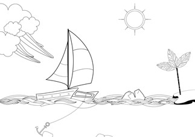
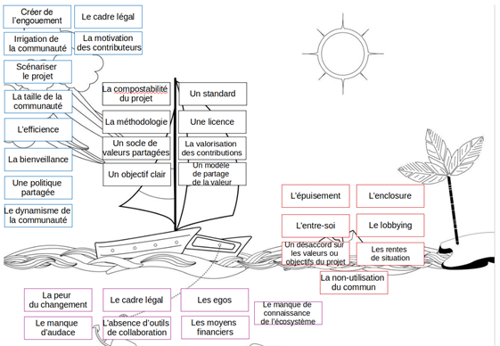

# Définir le cadre de collaboration d’un projet

### Méthodologie de l'atelier SpeedBoat

L’exercice collectif dit « du speedboat » a pour objectif de lister les leviers, freins et obstacles rencontrés par un projet de « commun numérique », ou qui peuvent se présenter à lui. Cet exercice permet également d’identifier les éléments structurants les plus adaptés pour tirer profit des leviers et anticiper les freins et obstacles potentiels.

**Il peut ainsi amener à poser les bases d’un cadre de collaboration qui donne confiance aux parties prenantes pour pérenniser le « commun numérique ».**

S’il est particulièrement utile au lancement d’un projet, il peut être mobilisable à tout moment de la vie d’un projet.

### Atouts de l’exercice pour un projet de communs

* Outil pratique pour se poser les bonnes questions et créer du consensus
* Ludique 
* Peut être mobilisable à tout moment de la vie d’un projet

### Pré-requis

* Imprimer le support ci-dessous en format A0 ou A1 
* Prévoir des post-its et des feutres
* Éventuellement, prévoir un moyen de chronométrer le temps de parole de chacun, pour assurer la fluidité de l’exercice et la bonne participation de tous.

### Méthodologie

#### Définition des éléments

Dans un premier temps, il convient de présenter aux participant.e.s chaque élément du dessin ainsi que ça signification.

* Le bateau = la communauté 
* Le mât = le cadre structurant, les éléments de confiance 
* Les vents porteurs = les leviers externes
* Les ancres = les freins
* Les rochers = les causes d’échec potentiel
* Optionnellement, les îles = les objectifs à atteindre
* Optionnellement, le soleil, bonus ?

#### Déroulé

Chaque phase est à formater en fonction du temps de l’atelier et du nombre de participants. A titre indicatif, le déroulé peut suivre cette logique :

* Temps de réflexion autour du bateau \(éventuellement de l’île en parallèle\), par exemple de manière collective, à l’oral, ou grâce à des post it que les participant.e.s viennent coller librement sur le bateau, dans l’idée de définir collectivement le périmètre de la communauté qui développe le commun.
* Temps de réflexion autour des vents porteurs, des ancres, des rochers
* Les participant.e.s peuvent lister individuellement \(ou en petits groupes\) des éléments sur des post-it pendant un temps donné.
* Chacun.e colle ses post-its sur le support, en expliquant ses choix à voix haute
  * L’animateur peut regrouper les post-ils en « familles » au fur et à mesure pour plus de lisibilité, puis synthétiser les idées principales qui en ressortent.
* Temps de réflexion, atour du mât
  * Les participants peuvent lister individuellement \(ou en petits groupes\) des éléments sur des post-it
  * Cette phase peut clore l’exercice, du fait qu’elle est positive et structurante, les participants ayant identifiés les éléments structurants pour assurer le développement et la pérennité du projet.

### Aller plus loin 

* Possibilité de faire travailler les participants sur un ou plusieurs des éléments structurants identifiés sur le mât \(par ex : charte, valeurs communes, etc.\) de manière plus approfondie et précise.
* Possibilité de partager avec les participants les [Piliers d’un projet de commun numérique](../referentiel/favoriser-la-perennite-dun-commun/) »  pour les inspirer et/ou les faire réagir.

