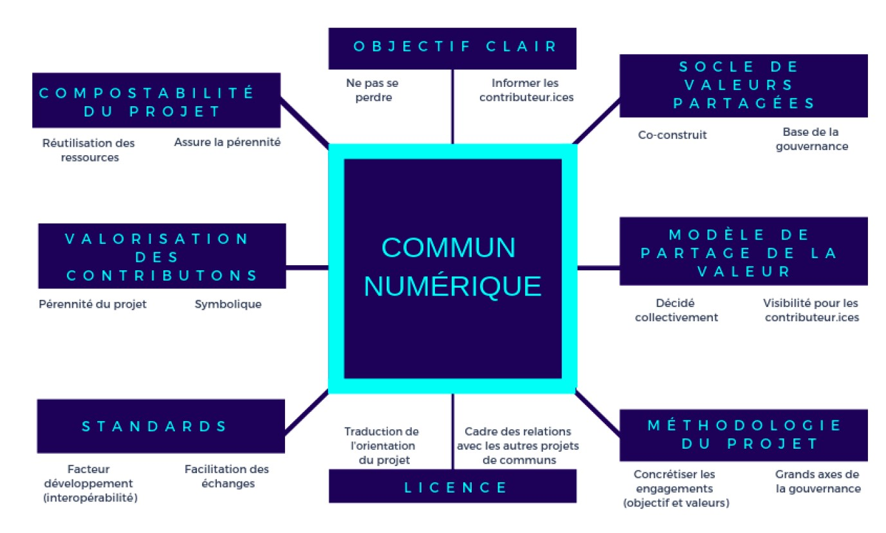

# Favoriser la pérennité d’un commun

La pérennité d’un commun numérique repose sur la définition d’un ensemble d’éléments clés, qu’il convient d’identifier et d’adresser le plus en amont possible avec les différent.e.s contributeur.ice.s au projet.

Constitutifs du cadre de collaboration du projet, ces éléments ont vocation à donner confiance à l’ensemble des parties prenantes en leur fournissant un environnement sécurisant, propice à la création, leur permettant d’innover librement. Ces éléments peuvent varier dans leur contenu ou leur forme, mais recouvrent globalement ces 8 piliers :

Ces différents éléments peuvent se formaliser au travers plusieurs documents clés, mis à disposition de la communauté de manière transparente, ainsi qu’aux tiers lorsque pertinent. Il est fréquent que ces documents prennent, entre autres, la forme d’une charte ou d’une politique de contribution.


Source : Atelier \#3 "Pérenniser les communs", Lab SoNum x Inno³, 2019


