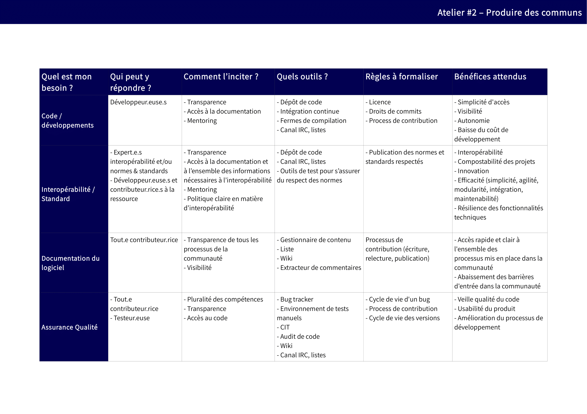
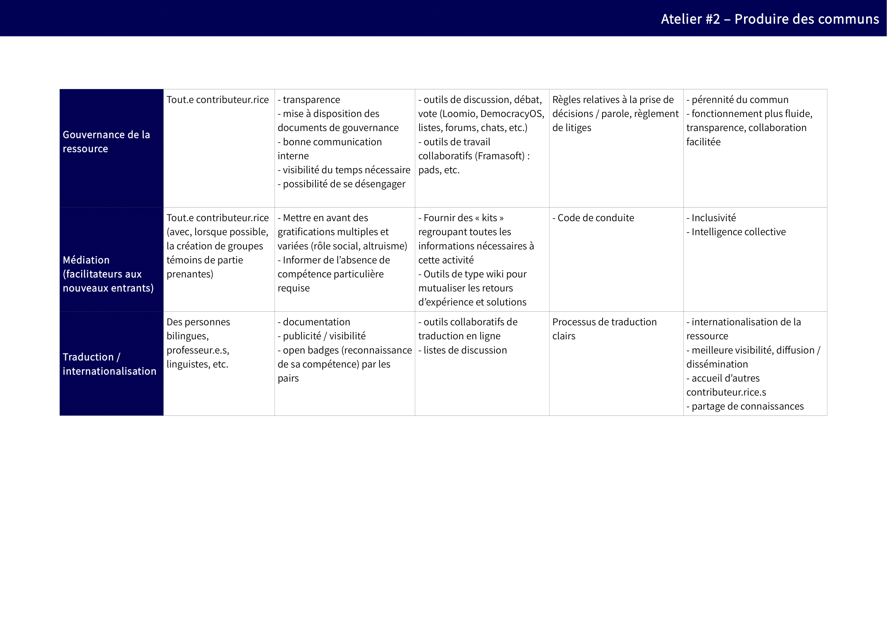

# 3. Les options des projets impliquant des Collectivités Territoriales

Dans une démarche collaborative de production de communs numériques, il est nécessaire d’identifier précisément et d’isoler chaque besoin susceptible d’être couvert par un contributeur, afin de permettre dans un second temps à toute personne de proposer une contribution la plus utile au projet.

## 3.1. Qui peut répondre aux besoins de développement du commun et de quelle manière ?

En matière de commun numérique, de multiples besoins fréquents s’ajoutent à des besoins plus spécifiques à certains projets. Ils peuvent être différenciés ainsi :

* **Les besoins classiques à tout projet numérique** : développer la ressource, réaliser la documentation, traduire les productions, etc. 
* **Les besoins spécifiques à la dimension collaborative et inclusive du commun numérique** : assurer la médiation entre les différents contributeurs, susciter la contribution par divers mécanismes, etc. 

  Il est important de comprendre que ces différents besoins peuvent être couverts par différentes communautés d’acteurs \(graphistes, développeurs, designers, universitaires, techniciens, adminsys, etc.\) et que chacune de ces communautés doit bénéficier d’outils adaptés à un travail collaboratif, de processus spécifiques,  voire d’un cadre de contribution qui leur sont propres.

**Ressources**

* Sur notre framagit, vous pourrez retrouver la [Liste des besoins fréquents d’un commun](https://framagit.org/inno3/tutoriel-communs-numeriques/blob/master/referentiels/2_Tableau_OrganiserLaContribution.odt) \(référentiel coconstruit listant un certain nombre de besoins fréquents formalisés au sein de projets de commun numérique\), afin de la télécharger pour la compléter et l'adapter à votre commun. 
* Pour aller plus loin, vous pouvez consulter une synthèse des présentations liées à l'identification des ressources [ici](https://vbachelet.frama.io/tutoriel-communs-numeriques/Pre-Atelier-02/)

## 

Plusieurs éléments doivent être considérés afin de mettre en place un cadre efficace pour structurer la contribution à la ressource :

* **Un outillage spécifique nécessaire pour favoriser les contributions collaboratives**, tel un wiki pour la documentation, une forge logicielle pour le développement, etc. 
* **Des processus particuliers afin de fluidifier les contributions**, par exemple une politique de traduction afin d’intégrer les contributions dans le cadre de l’internationalisation du projet; 
* **Des modalités spécifiques de contributions**, par exemple pour gérer les droits de propriété intellectuelle des développeurs tiers salariés – cf. [4.1 Faut-il formaliser des règles pour pérenniser le commun numérique ?](https://vbachelet.frama.io/tutoriel-communs-numeriques/02-Tutoriel/#41-faut-il-formaliser-des-regles-pour-perenniser-le-commun-numerique).

  Toutes ces règles doivent être publiées de manière transparente. Elles peuvent évoluer en fonction de la vie du projet, mais gagnent à être anticipées afin de fluidifier les processus dès l’arrivée de nouveaux contributeurs. 

Ce cadre est constitutif de l’environnement ouvert et inclusif au sein duquel plusieurs communautés pourront cohabiter, il devra ensuite être accompagné d’une démarche «classique» d’animation de communauté, en interne comme en externe, afin de «faire vivre» le projet au travers des personnes qui le composent.

**Ressources**

  Vous pourrez retrouver ce [Tableau des outils et processus contributifs](https://framagit.org/inno3/tutoriel-communs-numeriques/blob/master/referentiels/2_Tableau_OrganiserLaContribution.pdf) sur notre framagit, afin de vous emparer de ce référentiel coconstruit listant les outils et processus susceptibles d’être mis en place afin de susciter et accueillir les contributions de différentes familles de contributeurs, en fonction des bénéfices attendus de ces contributions.

