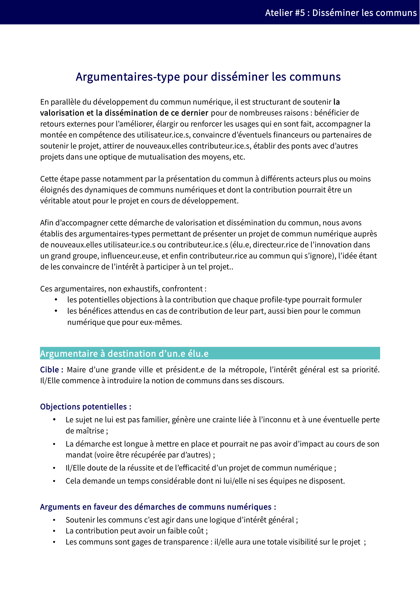

# 5. Financer

## 5.1. Quand est-il pertinent de financer le développement d'un commun & que faut-il financer ?

Que la pérennité du commun repose sur la définition d’un modèle économique \(cf. [4.5 Faut-il associer un modèle économique au commun numérique ?](04-perenniser.md#4-5-faut-il-associer-un-modele-economique-au-commun-numerique)\) ou non, il y aura toujours un certain nombre de financements à assurer : directement par l’organisation conçue pour soutenir le commun, ou indirectement, grâce aux contributeurs du commun numérique.

Les possibilités de financements externes du projet, si elles doivent être mûrement réfléchies afin de participer à renforcer ce commun numérique et non à le faire vivre artificiellement, gagnent à être connues et maîtrisées.

De tels financements doivent enfin être strictement limités aux besoins réels de financement, et ne pas faire courir de charges trop importantes à l’égard du projet, au risque sinon que ce qui était un moyen devient une fin.

**Ressources**

[Liste des besoins de financement et dispositifs associés](../ressources/) : référentiel coconstruit listant les besoins de financement d’un commun numérique et des dispositifs existants, par typologie de financeurs et de besoins.

## 5.2. Comment gérer les financements externes soutenant la production du commun ?

Dès lors que ces flux financiers existent, soit au bénéfice du commun numérique soit en provenance de ce dernier, la question des conditions et modalités de financement doit être soulevée. La réponse dépendra alors à la fois de la manière dont le commun numérique est structuré \(et plus spécifiquement de l’existence d’une personnalité juridique\), du type de besoin à financer et de la personnalité juridique de celui qui souhaite financer le développement du commun.

D’un point de vue du commun numérique, il est opportun d’anticiper les différentes modalités de financements organisés ainsi que les différents besoins susceptibles d’être ainsi pourvus. Compte tenu des enjeux en termes de transparence et de gouvernance, et des valeurs associées aux communs numériques, de telles sources de financement pourront être clairement définies ainsi que les modalités d’affectation des sommes.

**Ressources**

Pour aller plus loin, vous pouvez consulter une synthèse des présentations liées au financement des communs [ici](05-financer.md)

## 5.3. Existe-t-il des dispositifs de mutualisation à destination des communs ?

Par nature, les documents standardisés utilisés par les différents communs sont autant de sources de mutualisation possible, permettant notamment d’opérer une véritable transversalité technique, juridique et économique entre les différents communs. Il y a ainsi une sorte de _mutualisation by design_.

Il n’existe en revanche pas d’ «initiatives autonomes généralistes» spécifiquement destinées à mutualiser les différentes ressources en cours de développement \(au-delà des exemples sectoriels évoqués tels que la Fabrique des mobilités, la Coop des communs, etc.\), ni même à permettre une mutualisation de financements.

Toutefois, l’émergence croissante de fonds de dotation pourra à terme permettre un cofinancement de multiples projets de communs numériques d’ «intérêt général» – à l’instar du fonds de dotation Open Law destiné à financer beaucoup plus de projets que ceux spécifiquement portés par l’organisation.

## 6. Disséminer

### 6.1. Pourquoi disséminer un commun numérique au-delà de sa communauté initiale ?

La pérennité du commun repose notamment sur la communauté qui le compose. Dans le domaine numérique, un tel objectif passe en premier lieu par l’augmentation du nombre d’utilisateurs. En effet, la démultiplication des utilisateurs ne réduit par la valeur ni même l’usage du commun numérique \(cf. [1.1.1 Comment se caractérise un commun numérique ?](01-comprendre.md#1-1-1-comment-se-caracterise-un-commun-numerique)\) mais favorise au contraire l’accroissement du nombre de contributeurs finaux.

La dissémination doit aussi viser, au-delà du nombre, à enrichir la communauté des utilisateurs de personnes aux profils différents. Cette diversité permet d’éviter l’entre-soi, de renforcer le caractère générique du commun numérique et, ce faisant, d’ouvrir les champs d’application potentiels.

### 6.2. Comment organiser la démarche de dissémination d’un commun numérique ?

Afin de toucher le plus large public possible, la dissémination reposera notamment sur une communication adaptée à différents profils. Elle devra être à la fois passive \(rendre accessible l’information à ceux qui la recherchent\) et active \(toucher de nouvelles personnes par des démarches spécifiques\).

Selon les cibles, une telle communication devra mettre en avant la finalité du projet \(par exemple «encyclopédie botanique collaborative» pour Tela Botanica ou «base de données géographiques communautaire» pour Open Street Map\), ou encore son caractère de commun et/ou Open Data et/ou Logiciel Libre. La communication est d’autant plus complexe que la culture du commun n’est pas encore complètement démocratisée.

Dans une approche collaborative, il peut être intéressant de prévoir des ressources prêtes à l’emploi et accessibles à tous au niveau du projet afin que tous les contributeurs puissent participer à cette dissémination du projet sans dénaturer l’image du projet. Dans le même esprit, l’aspect ouvert du commun amène à diffuser ces mêmes supports au-delà de la communauté afin que quiconque souhaite s’informer ou communiquer sur le projet dispose des éléments appropriés pour le faire.

**Ressources**  Vous pourrez retrouver cet argumentaire ainsi que d'autres à destination de publics différents sur notre framagit : [Liste d’argumentaires](../ressources/argumentaires-type-pour-disseminer-les-communs/). Chaque argumentaire constitue un référentiel coconstruit listant les besoins un certain nombre d’arguments susceptibles d’être mis en avant afin de communiquer sur le caractère particulier du commun et les avantages associés.

