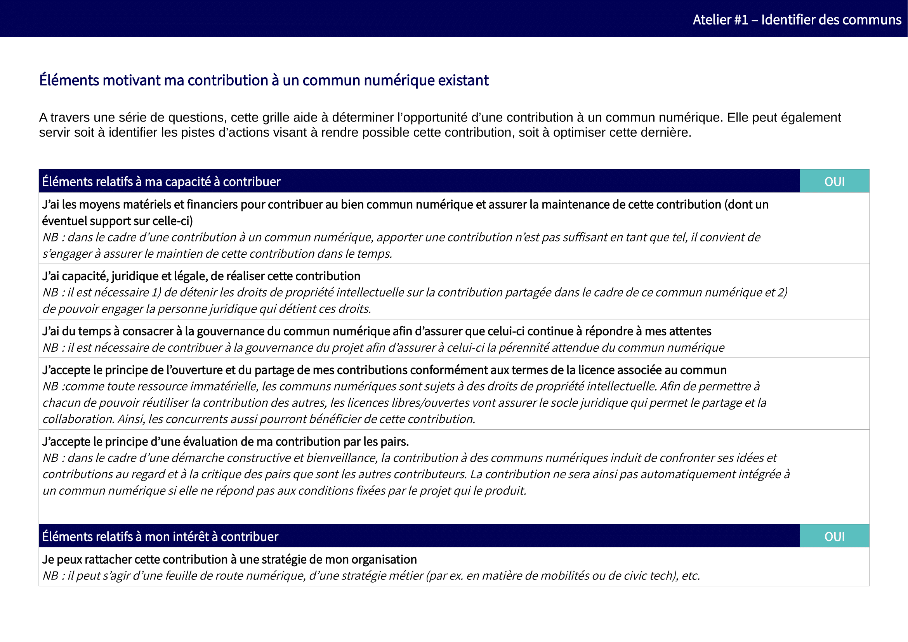
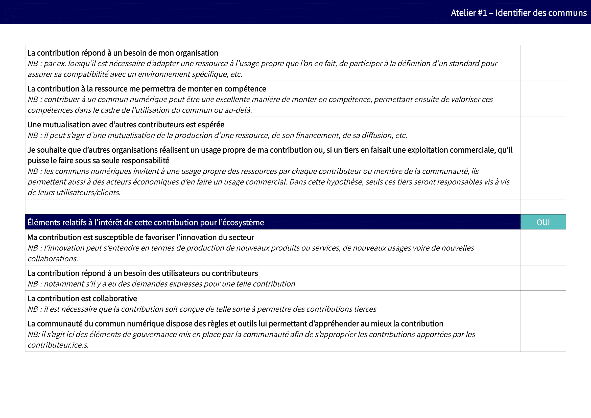
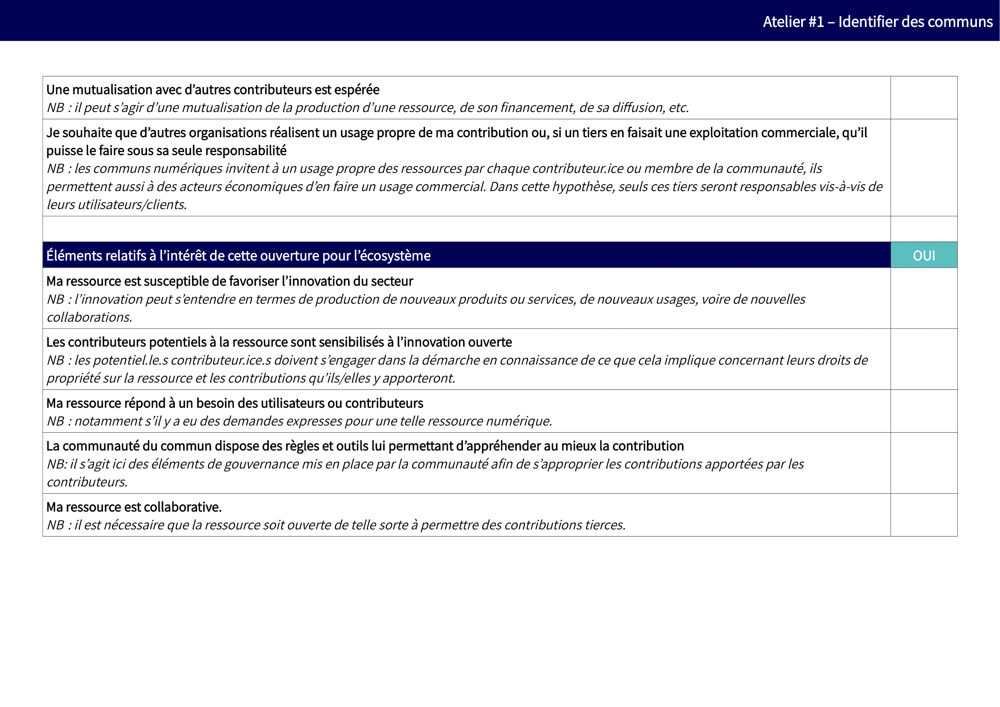

# 2. Identifier 

## 2.1. Où trouver des communs numériques susceptibles de répondre à des besoins spécifiques ?

La première étape, pour qui souhaite initier un projet de commun numérique, consiste à rechercher s’il n’existe pas une ressource susceptible de répondre complètement ou partiellement à ses besoins. En effet, il sera plus aisé de contribuer à un commun numérique existant de manière à l’adapter à ses besoins en participant à l’effort collectif, plutôt que de créer une nouvelle ressource susceptible de diviser les efforts d’une communauté.

Par ailleurs, dans le cas où cette recherche ne permettrait pas d’identifier un commun répondant aux besoins formulés, elle aura pour bénéfice d’identifier des projets complémentaires ou inspirants dont il serait intéressant de se rapporter par la suite. 

Il n’existe pas à l’heure actuelle d’annuaires répertoriant tous les projets de communs numériques, ainsi faut-il généralement se rapprocher des initiatives sectorielles (telles que la Fabrique des mobilités, Federation-Open Space Maker, Fabrique de la logistique, Transiscope, etc.) ou encore transverses (telle que Plateformes en communs). 

En l’absence d’un telle initiative pour le secteur dans lequel s’inscrit votre besoin, il peut alors être intéressant de se tourner vers des acteurs plus généralistes, tels que l’Assemblée des communs ou la Coop des communs, qui relient de nombreux projets.

**Liste d'exemples de communs numériques [à compléter](https://mypads.framapad.org/mypads/?/mypads/group/atelier-tuto-commun-bpudv7pb/pad/view/exemples-de-communs-numeriques-19m6b7ws)**

## 2.2. Comment évaluer l'opportunité de contribuer à un commun numérique ?

Que vous souhaitiez renforcer le développement d’un commun numérique et/ou l’adapter à vos besoins particuliers, la question de la contribution – qui peut prendre plusieurs formes et dimensions – se posera nécessairement. L’intérêt d’une telle ressource étant d’accepter et de cadrer de telles contributions, il est fort utile qu’un document présente les règles associées à chaque type de contributions potentielles. À noter que **tout le monde peut contribuer sans nécessairement avoir des compétences techniques poussées** !

Pour un contributeur potentiel, l’évaluation de l’opportunité de contribuer à un commun numérique doit ainsi être adaptée à l’aune :

   * **De la ressource à laquelle une telle contribution pourrait être apportée**. Tous les projets ne sont pas nécessairement outillés pour recevoir de telles contributions et, parfois, la première contribution utile peut être de favoriser un tel cadre collaboratif. 
   * **Des contraintes rattachées à sa propre organisation** : même si les communs numériques sont, par nature, favorables à la libre concurrence, la coopération  et à l’innovation, il est nécessaire de faire valider en interne à l’organisation (sauf pour les enseignants auteurs de leurs contenus) le principe d’une telle contribution (notamment lorsque celle-ci génère des droits de propriété intellectuelle).
Ces précautions d’usage mises en œuvre – autant pour le contributeur que la communauté concernée –, il sera relativement simple d’évaluer l’opportunité et la faisabilité d’une telle approche.

**Ressources**

Sur notre framagit, vous pourrez retrouver cette [Grille d’opportunité pour la contribution](https://framagit.org/inno3/tutoriel-communs-numeriques/blob/master/referentiels/1_Grille_OpportuniteContribution.odt) afin de la télécharger et de la modifier.

Nous vous invitons également à consulter la [politique de contribution open-source de la DINSIC](https://disic.github.io/politique-de-contribution-open-source/)
   
## 2.3. Comment évaluer l'opportunité d'amorcer un commun numérique ?

Dans le cas où il n’existerait pas de commun numérique adapté à des besoins pourtant collectivement partagés (c’est encore malheureusement souvent le cas), il est toujours possible de partager une ressource existante et/ou d’initier une démarche de conception d’un commun.

De telles démarches supposent une évaluation en amont, à plusieurs niveaux :

   * **Le premier niveau concerne l'existence d'une communauté réelle ou pressentie**, cela s'appréciant notamment par l’intérêt que la ressource est susceptible de générer au profit des autres acteurs du secteur (cf. [1.3. Pourquoi choisir le modèle des communs numériques pour une ressource ?](https://vbachelet.frama.io/tutoriel-communs-numeriques/02-Tutoriel/#13-pourquoi-choisir-le-modele-des-communs-numeriques-pour-une-ressource)).
   * **Le second niveau concerne la ressource**, afin de déterminer dans quelle mesure celle-ci se prête à un développement collaboratif. 
   * **Le troisième niveau concerne l'organisation**, afin de déterminer dans quelle mesure sont réunies la qualité (notamment juridique) et les compétences nécessaires (en interne ou externe) pour le faire. 
La réponse n’est pas binaire, ces réflexions sont seulement là pour permettre de prendre du recul sur ces démarches afin d’anticiper les leviers et obstacles. Ainsi, à défaut de communauté, il est toujours possible de commencer seul puis ouvrir à d'autres. 

Par ailleurs, une autre solution peut consister, non pas à développer votre ressource pour ensuite l’ouvrir aux contributions tierces, mais à développer dès l’origine cette ressource de manière collective avec d’autres acteurs intéressés. 

**Ressources**

Sur notre framagit, vous pourrez retrouver cette [Grille d’opportunité pour la conception d’un commun](https://framagit.org/inno3/tutoriel-communs-numeriques/blob/master/referentiels/1_Grille_OpportuniteOuverture.odt) afin de la télécharger et de la modifier.
