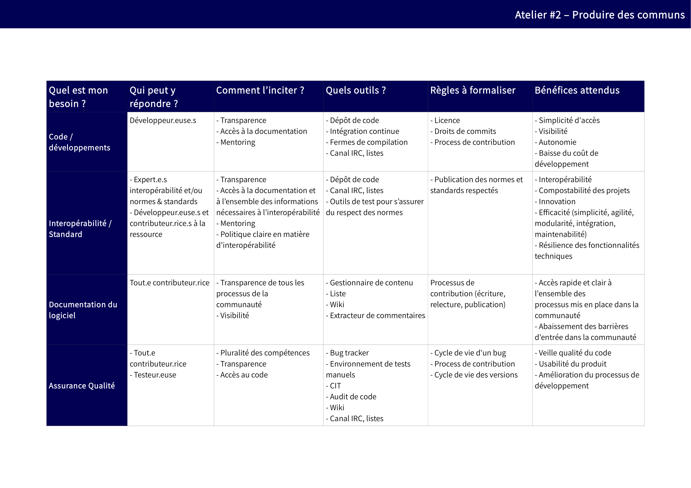
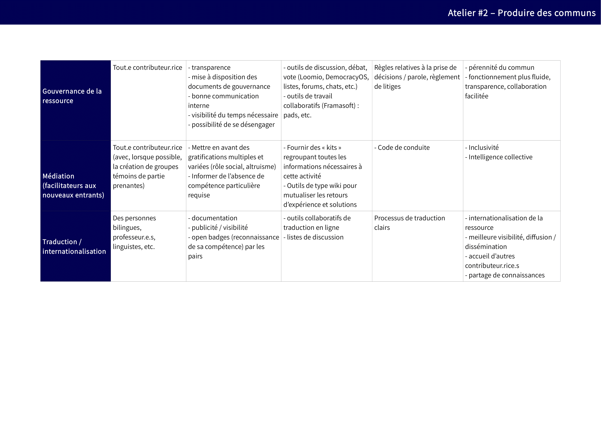
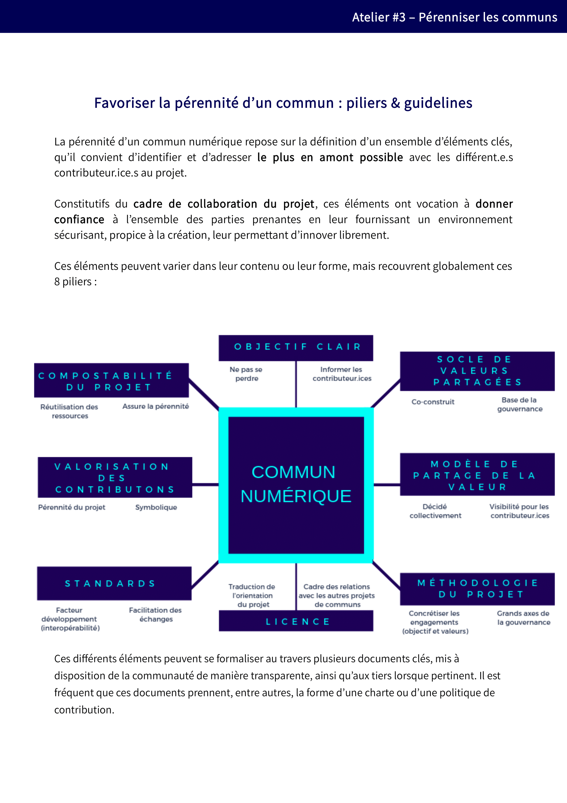
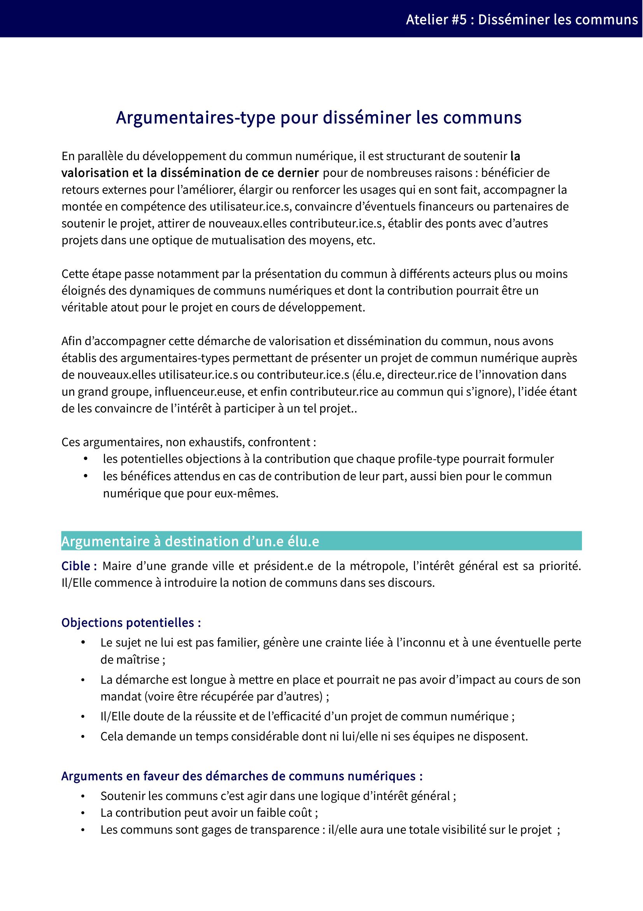

# Tutoriel Communs numériques

## Préambule

Le numérique facilite la collaboration en invitant les organisations provenant de tout secteur confondu, à se rapprocher sous ce langage commun. Ainsi, la transformation numérique des organisations les amène à entrer dans une démarche d’ouverture et de collaboration, facilitée par le perfectionnement d’outils de travail collaboratif. Toutes les organisations sont naturellement amenées à s’ouvrir vers l’extérieur afin de développer en interne des projets créés à l'extérieur, et réciproquement de valoriser à l’extérieur des projets initiés en interne. Pour toutes ces raisons, des acteurs de secteurs très divers s'intéressent aujourd'hui de près aux modèles ouverts. Conscients qu’ils ne peuvent plus maintenir leur compétitivité en innovant seuls, ils souhaitent aborder le marché sous un angle nouveau.

Le numérique est la source d’un nouvel élan pour le mouvement des communs, ce n’est donc pas une surprise si de plus en plus d’acteurs publics et privés se regroupent afin de faire émerger de tels communs comme alternatives viables aux logiques des acteurs dominants du numérique.

Ce phénomène repose néanmoins sur d’importants changements culturels, afin que tous les acteurs puissent pleinement bénéficier et contribuer à ces ressources communes.

Ce tutoriel s’adresse à toutes celles et tous ceux qui souhaitent développer un projet de commun numérique, ainsi qu’à toutes les personnes – publiques comme privées – impliquées dans le développement ou le maintien de tels projets.

Il a pour objectif de répondre aux principales questions qui entourent l’émergence et la pérennisation de ces communs numériques. Il abordera ainsi 6 grandes thématiques reprenant les grandes étapes du déploiement d’un projet de commun numérique, et apportera des ressources utiles pour accompagner les porteurs de projets à chacune de ces étapes.

## 1 - Comprendre

### 1.1. Quand parle-t-on de communs numériques ?

#### 1.1.1. Comment se caractérise un commun numérique ?

Un commun désigne une ressource produite et/ou entretenue collectivement par une communauté d’acteurs hétérogènes, et gouvernée démocratiquement selon des règles qui lui assurent son caractère collectif et partagé \(cf. [4. Maintenir/Pérenniser](https://vbachelet.frama.io/tutoriel-communs-numeriques/02-Tutoriel/#4-maintenir-perenniser)\). Il est dit numérique lorsque la ressource est dématérialisée : logiciel, base de données, contenu numérique \(texte, image, vidéo et/ou son\), etc.

[Lien wikipédia](https://fr.wikipedia.org/wiki/Biens_communs_num%C3%A9riques)

#### 1.1.2. Quelles sont les caractéristiques propres aux communs numériques ?

Les communs numériques ont des caractéristiques nouvelles : l’usage de la ressource par les uns n'en limite pas les possibilités d’usage par les autres \(**la ressource est non-rivale**\), et sa préservation ne passe pas par la réservation du droit d'usage à une communauté restreinte \(**la ressource est non-exclusive**\).

Ainsi, les communs numériques gagnent à être partagés, car ce partage augmente directement la valeur d'usage de la ressource et permet par ailleurs d’étendre la communauté qui la préservera. Le numérique est donc à l’origine du développement de communs d’un nouveau genre - par différenciation avec les communs naturels ou matériels -, ouverts et partagés, accroissant d’autant plus leur potentiel.

#### 1.1.3. Communs numériques et logiciels libres

Ainsi définis comme des ressources non-exclusives et non-rivales produites et/ou entretenues collectivement par une communauté d’acteurs hétérogènes, et gouvernées démocratiquement selon des règles qui assurent leur caractère collectif et partagé, les communs numériques pourraient être assimilés aux logiciels libres. Or, il existe entre les deux notions deux différences majeures, qui seront à la source de difficultés pour tout projet de commun numérique désireux de se structurer avec pour seul cadre juridique une licence libre: la gouvernance démocratique et le partage de la valeur.

**La gestion démocratique** de la ressource est en effet une caractéristique essentielle des communs numériques, mais qui peut faire défaut à certains projets libres, n’étant pas envisagée par les licences libres. Cette difficulté peut cependant être rapidement surmontée par l’adoption d’un cadre structurant dépassant la seule licence \(statuts, charte, etc. - cf. [4.1. Faut-il formaliser des règles pour pérenniser le commun numérique ?](https://vbachelet.frama.io/tutoriel-communs-numeriques/02-Tutoriel/#41-faut-il-formaliser-des-regles-pour-perenniser-le-commun-numerique)\). A l’inverse, la question du **partage de la valeur générée** pose plus de difficultés. En effet, la logique du logiciel libre est d’en assurer la dissémination la plus large possible et sans restriction, la pérennisation du logiciel étant assurée par son usage par le plus grand nombre. A l’inverse, l’idée au cœur même de la notion des communs est la préservation d’une ressource par une communauté afin de pouvoir en retour tirer profit de cette ressource, selon un principe de réciprocité. Ainsi, certains projets de communs numériques, afin d’assurer cette réciprocité et une juste valorisation du travail de maintenance et de développement de la ressource numérique, ont fait le choix de limiter les droits d’accès à et/ou de prélèvement sur cette ressource, dérogeant ainsi aux standards du Libre et de l’open-source. Dans le même temps, plusieurs éditeurs de logiciels libres ont adopté des licences non reconnues comme libres ou open-source, afin d’éviter le phénomène de captation de la valeur générée par la ressource par des acteurs ne contribuant pas à son entretien.

On voit ainsi qu’il existe des contradictions entre les principes des communs numériques et ceux des logiciels libres. Toutefois de nouvelles solutions sont en cours d’élaboration afin d’assurer la valorisation du travail de développement et maintien des communs numériques tout en respectant les définitions du Libre et de l’open-source. Ces solutions se fondent notamment sur la licence de marque ou les smart-contracts.

### 1.2. Où trouve-t-on des communs numériques ? Dans quels secteurs ?

Les exemples de communs numériques les plus évidents, car utilisés au quotidien, sont probablement le système d’exploitation Linux, le navigateur web Firefox et l’encyclopédie en ligne Wikipédia.

De plus en plus de bases de données collaboratives émergent aussi comme communs numériques, tels OpenStreetMap en matière de données géographiques, Open Food Facts pour les produits alimentaires ou encore TelaBotanica, véritable encyclopédie botanique collaborative.

La numérisation croissante des différents secteurs industriels favorise les logiques de mutualisation et collaboration qui se formalisent par une multiplication de communs numériques «sectoriels» \(énergie, banque, mobilité, santé, etc.\). Exemples :

* [Projet Apollo Auto](https://github.com/incubateur-territoires/tutoriel-communs/tree/3013883386afb32c2faf395cf1921ecb467d1f86/tutoriel/Apollo.auto); 
* [Linux Foundation Energy](https://www.lfenergy.org/); 
* [Federation OpenSpaceMakers](https://www.federation-openspacemakers.com/fr/)

### 1.3. Pourquoi choisir le modèle des communs numériques pour une ressource ?

**La mutualisation est généralement le premier bénéfice tiré de la mise en commun d’une ressource** : mutualisation en termes de temps de conception, de maintenance, de ressources, etc. Plus encore, produire un commun numérique permet d’ériger une ressource comme référence dans un domaine. La valeur étant liée à l’usage qui en est fait – l’utilisation par les uns renforçant la valeur pour les autres – son adoption généralisée est une motivation suffisante en tant que telle.

**À la fois facteurs d’innovation, de libre concurrence et de coopération ouverte, les communs numériques s’accompagnent d’une collaboration facilitée dans tous les champs de notre société, créant des ponts entre le secteur privé et le secteur public, le champ lucratif et le non lucratif**. À l’échelle d’une organisation, l’adoption d’une démarche de communs numériques est généralement liée à la prise de conscience d’une nécessité de transformation numérique, permettant de conforter ses atouts stratégiques, de gagner en attractivité et d’attirer de nouveaux talents. À l'échelle de la ressource, c'est aussi un gage de pérennité, d'émancipation et de résilience vis-à-vis des contributeurs.

Plus spécifiquement, pour un acteur public, le recours au modèle des communs présente l’avantage d’offrir une **plus grande richesse ainsi qu'une meilleure répartition de la valeur produite par la collectivité**, mais également d’engager les usagers d’un service dans une démarche de maintenance et de développement de ce dernier. Cela permet également de **renforcer l’accessibilité à ce service**. En ce sens, il peut être intéressant, du point de vue d’une administration, d’envisager _a priori_ toute ressource numérique produite par elle comme un commun, sauf à ce que cela soit contraire à ses objectifs ou intérêts. Cette posture rejoint le régime de l’«Open Data par défaut» introduit par la Loi pour une République Numérique, posant ainsi un cadre et une pérennité nécessaire pour donner sens à ces obligations.

Lien : [Loi pour une République Numérique](https://www.economie.gouv.fr/republique-numerique)

### 1.4. À quoi engage le développement d'un commun numérique ?

Les bénéfices qui précèdent restent néanmoins les fruits des efforts qui accompagnent nécessairement une telle démarche. Plus que la simple production ou ouverture d’une ressource, le développement d’un projet de commun numérique impose le maintien d’une vigilance forte à l’égard de la ressource, mais aussi au bénéfice de la communauté et de ses règles de gouvernance.

Toute la structuration du commun doit intégrer des dispositifs d'accompagnement, une animation et des pratiques qui assurent le caractère ouvert et inclusif du projet. Cela impose des efforts dédiés pour accompagner la venue et la fidélisation des membres d’une communauté, ainsi qu’un certain nombre de bonnes pratiques intéressantes au-delà de cette seule communauté \(documentation du code, outils de commentaires, etc.\).

De la même façon, il est nécessaire de définir et de faire respecter un cadre assurant le caractère collaboratif, ouvert et inclusif du commun, afin que la communauté de contributeurs et d’utilisateurs puisse s’épanouir.

Engager le développement d’un commun nécessite donc un engagement sur la durée, qui ne se résorbera que lorsqu’une communauté suffisante aura rejoint le projet.

**Ressources**

Pour aller plus loin, vous pouvez consulter une synthèse des présentations liées à l'identification des ressources [ici](https://vbachelet.frama.io/tutoriel-communs-numeriques/Pre-Atelier-01/)

## 2. Identifier

### 2.1. Où trouver des communs numériques susceptibles de répondre à des besoins spécifiques ?

La première étape, pour qui souhaite initier un projet de commun numérique, consiste à rechercher s’il n’existe pas une ressource susceptible de répondre complètement ou partiellement à ses besoins. En effet, il sera plus aisé de contribuer à un commun numérique existant de manière à l’adapter à ses besoins en participant à l’effort collectif, plutôt que de créer une nouvelle ressource susceptible de diviser les efforts d’une communauté.

Par ailleurs, dans le cas où cette recherche ne permettrait pas d’identifier un commun répondant aux besoins formulés, elle aura pour bénéfice d’identifier des projets complémentaires ou inspirants dont il serait intéressant de se rapporter par la suite.

Il n’existe pas à l’heure actuelle d’annuaires répertoriant tous les projets de communs numériques, ainsi faut-il généralement se rapprocher des initiatives sectorielles \(telles que la Fabrique des mobilités, Federation-Open Space Maker, Fabrique de la logistique, Transiscope, etc.\) ou encore transverses \(telle que Plateformes en communs\).

En l’absence d’un telle initiative pour le secteur dans lequel s’inscrit votre besoin, il peut alors être intéressant de se tourner vers des acteurs plus généralistes, tels que l’Assemblée des communs ou la Coop des communs, qui relient de nombreux projets.

**Liste d'exemples de communs numériques** [**à compléter**](https://mypads.framapad.org/mypads/?/mypads/group/atelier-tuto-commun-bpudv7pb/pad/view/exemples-de-communs-numeriques-19m6b7ws)

### 2.2. Comment évaluer l'opportunité de contribuer à un commun numérique ?

Que vous souhaitiez renforcer le développement d’un commun numérique et/ou l’adapter à vos besoins particuliers, la question de la contribution – qui peut prendre plusieurs formes et dimensions – se posera nécessairement. L’intérêt d’une telle ressource étant d’accepter et de cadrer de telles contributions, il est fort utile qu’un document présente les règles associées à chaque type de contributions potentielles. À noter que **tout le monde peut contribuer sans nécessairement avoir des compétences techniques poussées** !

Pour un contributeur potentiel, l’évaluation de l’opportunité de contribuer à un commun numérique doit ainsi être adaptée à l’aune :

* **De la ressource à laquelle une telle contribution pourrait être apportée**. Tous les projets ne sont pas nécessairement outillés pour recevoir de telles contributions et, parfois, la première contribution utile peut être de favoriser un tel cadre collaboratif. 
* **Des contraintes rattachées à sa propre organisation** : même si les communs numériques sont, par nature, favorables à la libre concurrence, la coopération  et à l’innovation, il est nécessaire de faire valider en interne à l’organisation \(sauf pour les enseignants auteurs de leurs contenus\) le principe d’une telle contribution \(notamment lorsque celle-ci génère des droits de propriété intellectuelle\).

  Ces précautions d’usage mises en œuvre – autant pour le contributeur que la communauté concernée –, il sera relativement simple d’évaluer l’opportunité et la faisabilité d’une telle approche.

**Ressources**   Sur notre framagit, vous pourrez retrouver cette [Grille d’opportunité pour la contribution](https://framagit.org/inno3/tutoriel-communs-numeriques/blob/master/referentiels/1_Grille_OpportuniteContribution.odt) afin de la télécharger et de la modifier.

Nous vous invitons également à consulter la [politique de contribution open-source de la DINSIC](https://disic.github.io/politique-de-contribution-open-source/)

### 2.3. Comment évaluer l'opportunité d'amorcer un commun numérique ?

Dans le cas où il n’existerait pas de commun numérique adapté à des besoins pourtant collectivement partagés \(c’est encore malheureusement souvent le cas\), il est toujours possible de partager une ressource existante et/ou d’initier une démarche de conception d’un commun.

De telles démarches supposent une évaluation en amont, à plusieurs niveaux :

* **Le premier niveau concerne l'existence d'une communauté réelle ou pressentie**, cela s'appréciant notamment par l’intérêt que la ressource est susceptible de générer au profit des autres acteurs du secteur \(cf. [1.3. Pourquoi choisir le modèle des communs numériques pour une ressource ?](https://vbachelet.frama.io/tutoriel-communs-numeriques/02-Tutoriel/#13-pourquoi-choisir-le-modele-des-communs-numeriques-pour-une-ressource)\).
* **Le second niveau concerne la ressource**, afin de déterminer dans quelle mesure celle-ci se prête à un développement collaboratif. 
* **Le troisième niveau concerne l'organisation**, afin de déterminer dans quelle mesure sont réunies la qualité \(notamment juridique\) et les compétences nécessaires \(en interne ou externe\) pour le faire. 

  La réponse n’est pas binaire, ces réflexions sont seulement là pour permettre de prendre du recul sur ces démarches afin d’anticiper les leviers et obstacles. Ainsi, à défaut de communauté, il est toujours possible de commencer seul puis ouvrir à d'autres. 

Par ailleurs, une autre solution peut consister, non pas à développer votre ressource pour ensuite l’ouvrir aux contributions tierces, mais à développer dès l’origine cette ressource de manière collective avec d’autres acteurs intéressés.

**Ressources**

 

Sur notre framagit, vous pourrez retrouver cette [Grille d’opportunité pour la conception d’un commun](https://framagit.org/inno3/tutoriel-communs-numeriques/blob/master/referentiels/1_Grille_OpportuniteOuverture.odt) afin de la télécharger et de la modifier.

## 3. Produire

Dans une démarche collaborative de production de communs numériques, il est nécessaire d’identifier précisément et d’isoler chaque besoin susceptible d’être couvert par un contributeur, afin de permettre dans un second temps à toute personne de proposer une contribution la plus utile au projet.

### 3.1. Qui peut répondre aux besoins de développement du commun et de quelle manière ?

En matière de commun numérique, de multiples besoins fréquents s’ajoutent à des besoins plus spécifiques à certains projets. Ils peuvent être différenciés ainsi :

* **Les besoins classiques à tout projet numérique** : développer la ressource, réaliser la documentation, traduire les productions, etc. 
* **Les besoins spécifiques à la dimension collaborative et inclusive du commun numérique** : assurer la médiation entre les différents contributeurs, susciter la contribution par divers mécanismes, etc. 

  Il est important de comprendre que ces différents besoins peuvent être couverts par différentes communautés d’acteurs \(graphistes, développeurs, designers, universitaires, techniciens, adminsys, etc.\) et que chacune de ces communautés doit bénéficier d’outils adaptés à un travail collaboratif, de processus spécifiques,  voire d’un cadre de contribution qui leur sont propres.

**Ressources**

* Sur notre framagit, vous pourrez retrouver la [Liste des besoins fréquents d’un commun](https://framagit.org/inno3/tutoriel-communs-numeriques/blob/master/referentiels/2_Tableau_OrganiserLaContribution.odt) \(référentiel coconstruit listant un certain nombre de besoins fréquents formalisés au sein de projets de commun numérique\), afin de la télécharger pour la compléter et l'adapter à votre commun. 
* Pour aller plus loin, vous pouvez consulter une synthèse des présentations liées à l'identification des ressources [ici](https://vbachelet.frama.io/tutoriel-communs-numeriques/Pre-Atelier-02/)

### 3.2. Quel cadre mettre en place pour faciliter la contribution à la ressource ?

Une fois les besoins définis et les communautés identifiées \(cf. [3.1. Qui peut répondre aux besoins de développement du commun et de quelle manière ?](https://vbachelet.frama.io/tutoriel-communs-numeriques/02-Tutoriel/#31-qui-peut-repondre-aux-besoins-de-developpement-du-commun-et-de-quelle-maniere) \), un cadre doit être formalisé afin d’inciter, d’accueillir et de faciliter les contributions de ces communautés. Ce n’est qu’à cette condition que seront « transformées » les volontés de contributions en contributions réelles, chaque obstacle subsistant rendant moins certaine la contribution et plus difficile son intégration dans le commun numérique.

Plusieurs éléments doivent être considérés afin de mettre en place un cadre efficace pour structurer la contribution à la ressource :

* **Un outillage spécifique nécessaire pour favoriser les contributions collaboratives**, tel un wiki pour la documentation, une forge logicielle pour le développement, etc. 
* **Des processus particuliers afin de fluidifier les contributions**, par exemple une politique de traduction afin d’intégrer les contributions dans le cadre de l’internationalisation du projet; 
* **Des modalités spécifiques de contributions**, par exemple pour gérer les droits de propriété intellectuelle des développeurs tiers salariés – cf. [4.1 Faut-il formaliser des règles pour pérenniser le commun numérique ?](https://vbachelet.frama.io/tutoriel-communs-numeriques/02-Tutoriel/#41-faut-il-formaliser-des-regles-pour-perenniser-le-commun-numerique).

  Toutes ces règles doivent être publiées de manière transparente. Elles peuvent évoluer en fonction de la vie du projet, mais gagnent à être anticipées afin de fluidifier les processus dès l’arrivée de nouveaux contributeurs. 

Ce cadre est constitutif de l’environnement ouvert et inclusif au sein duquel plusieurs communautés pourront cohabiter, il devra ensuite être accompagné d’une démarche «classique» d’animation de communauté, en interne comme en externe, afin de «faire vivre» le projet au travers des personnes qui le composent.

**Ressources**

  Vous pourrez retrouver ce [Tableau des outils et processus contributifs](https://framagit.org/inno3/tutoriel-communs-numeriques/blob/master/referentiels/2_Tableau_OrganiserLaContribution.pdf) sur notre framagit, afin de vous emparer de ce référentiel coconstruit listant les outils et processus susceptibles d’être mis en place afin de susciter et accueillir les contributions de différentes familles de contributeurs, en fonction des bénéfices attendus de ces contributions.

## 4. Maintenir / Pérenniser

Le commun tire sa force de la pérennité du modèle sur lequel il repose. Ainsi, aussi longtemps qu’il est utile à ses utilisateurs, il doit pouvoir continuer à évoluer et s’adapter à leurs attentes.

Ce statut n’est néanmoins pas automatique, et nécessite notamment la formalisation d’un certain nombre de règles et la mise en place d’une gouvernance partagée. Il convient aussi d’anticiper les divers risques afin d’assurer un modèle pérenne techniquement, juridiquement et économiquement.

### 4.1. Faut-il formaliser des règles pour pérenniser le commun numérique ?

En bref, En bref, OUI. La mise en place de ce cadre est essentielle afin d’assurer la confiance entre les contributeurs et ainsi pérenniser le développement du projet. En effet, tout risque d’«appropriation» \(d’ «enclosure»\) non souhaitée sera très mal vécu par les membres de la communauté et doit être exclu. A cette fin, il est essentielle de mettre en place une gouvernance démocratique du commun, laissant la possibilité à chaque contributeur de s'exprimer, ainsi que d'être force de proposition.

Ce cadre regroupe l’ensemble des documents et pratiques structurantes à mettre en place afin de régir la collaboration des contributeurs au commun et prend différentes formes \(des statuts, une charte de valeurs, la licence attachée à la ressource, etc.\).

Chaque cadre de collaboration est unique, il s’adapte aux enjeux et problématiques propres au projet et à la communauté auxquels il se rapporte : relations entre contributeurs, valeurs partagées, relations avec l’extérieur, méthodes de travail, etc. L’harmonisation croissante des différents points ainsi abordés favorise la mutualisation entre les projets et rassure les contributeurs qui retrouvent ainsi des repères partagés entre les différents projets de communs.

**Ressources**   Ces piliers & lignes directrices pour favoriser la pérennité d’un commun constituent des exemples d'éléments-clés ayant vocation à donner confiance l’ensemble des parties prenantes en leur fournissant un environnement sécurisant et propice à la création. Vous pourrez en trouver une version éditable sur notre framagit; ainsi qu'une [Méthodologie pour définir le cadre de collaboration d’un projet](https://framagit.org/inno3/tutoriel-communs-numeriques/blob/master/ressources/M%C3%A9thodologie%20SpeedBoat%20-%20Cadre%20de%20collaboration.pdf) permettant la conduite d’un exercice collectif dit «du speedboat», qui a pour objectif de lister les leviers, freins et obstacles rencontrés par le projet ou qui peuvent se présenter à lui. Cet exercice permet également d’identifier les éléments structurants les plus adaptés pour tirer profit des leviers et anticiper les freins et obstacles potentiels.

### 4.2. Quelle gouvernance prévoir pour encadrer les relations entre les acteurs ?

Les relations des contributeurs à un projet de commun numérique sont nombreuses et diverses, allant de la simple coordination de contributions à des prises de décisions sur l’avenir de la ressource.

À cette fin, il est important de mettre en place une gouvernance pour structurer ces relations et, ainsi, de donner une légitimité interne aux décisions prises par la communauté. Les effets se feront sentir en termes de confiance accrue dans le projet en interne et en externe.

À ce titre, le choix ou non d’une structure juridique, partiellement ou totalement dédiée, pour formaliser cette gouvernance peut en conditionner ou implémenter certains aspects. Si la nécessité de disposer d’une personnalité juridique perdure afin d’agir en justice, de bénéficier de certaines aides ou de contractualiser, des outils numériques étendent aujourd’hui le champ des actions susceptibles d’être réalisées en dehors d’un tel cadre \(telle que la plateforme [OpenCollective](https://opencollective.com). La nécessité de créer une structure juridique, voire la solution intermédiaire d’être hébergé au sein d’une structure existante, est généralement recommandée lorsqu’un intérêt collectif fort réunit les différents acteurs ou qu’il existe un risque à maintenir la responsabilité des actions sur les seuls membres.

Les modèles associatifs ou coopératifs \(SCOP ou SCIC\) sont particulièrement souples et adaptés pour soutenir le développement d’un commun, néanmoins d’autres formes \(GIE, SAS, GIP, etc.\) peuvent parfaitement aboutir à des résultats similaires dès lors que leur objet est tourné vers la réalisation de cet objectif.

Par ailleurs, si la mise en place d’une gouvernance est essentielle, il n’existe pas de gouvernance idéale – sinon celle qui répond au mieux aux enjeux et problématiques spécifiques au projet auquel elle s’applique. La majorité des gouvernances de projets de communs numériques partagent certains éléments tels que la volonté d’être lisibles et compréhensibles par toutes les parties prenantes au projet, des mécanismes assurant la transparence des décisions prises, et des dispositifs permettant l’ouverture de la gouvernance aux contributeurs, voire aux partenaires externes au projet.

**Ressources**

Sur notre framagit, vous pourrez retrouver :

* [Des exemples de structurations juridiques constituées autour de communs numériques](https://framagit.org/inno3/tutoriel-communs-numeriques/blob/master/ressources/Exemples_StructuresJuridiques_Communs.pdf) : tableau synthétique basé sur les projets détaillés en atelier permettant de présenter les différentes structurations juridiques formalisées.
* [Des exemples de gouvernance](https://framagit.org/inno3/tutoriel-communs-numeriques/blob/master/ressources/ExemplesChartes-CadresCollaboration.pdf) : exemples des chartes rédigées par d’autres projets, notamment Federation et La Fabrique des mobilités.

### 4.3. À quels enjeux juridiques la communauté doit-elle répondre ?

Le droit se manifestant à chaque collaboration, tout projet de commun numérique devra s’organiser pour appréhender et utiliser les instruments juridiques lui permettant de renforcer le développement du projet, favoriser la confiance vis-à-vis des acteurs extérieurs du projet et accélérer l’innovation portée par le projet.

Les enjeux juridiques peuvent ainsi être multiples :

* **Concernant le développement de la ressource** : la licence du projet \(cf. [4.4. Pourquoi choisir une licence libre pour diffuser le commun numérique ?](https://vbachelet.frama.io/tutoriel-communs-numeriques/02-Tutoriel/#44-pourquoi-choisir-une-licence-libre-pour-diffuser-le-commun-numerique)\), les contrats avec les contributeurs, la marque, voire les brevets relatifs au projet et tous les autres aspects juridiques spécifiques à une réglementation \(notamment les règles en matière d’export, de santé, de chiffrement, etc.\). Des référentiels existent ; 
* **Concernant l’organisation des relations avec des tiers** : les prestations, les conventions de partenariats, les suivis de subventions ou des dons, les adhésions croisées ou encore les actions en justice.
* Ces enjeux juridiques sont importants à traiter, au risque sinon d’en faire peser la charge sur quelques contributeurs personnellement. Relativement communs aux projets de communs numériques, ils sont parfois mutualisés au sein de «fondations parapluies». 

**Ressources**

* [Veni, Vidi, Libri : le projet de l’association Veni Vedi Libri](https://github.com/incubateur-territoires/tutoriel-communs/tree/3013883386afb32c2faf395cf1921ecb467d1f86/tutoriel/vvlibri.org/fr/README.md) répondra aux principales questions rencontrées par des communs numériques.

### 4.4. Pourquoi choisir une licence libre pour diffuser le commun numérique ?

Juridiquement, les licences libres sont des contrats par lesquels les titulaires de droits de propriété intellectuelle concèdent gratuitement et de manière non exclusive l’ensemble de leurs droits d’exploitation, pour le monde entier et toute la durée de leurs droits. En pratique, ces contrats organisent un partage des droits qui permet à toute personne d’exploiter la ressource dans la même mesure que l’auteur original.

L’utilisation de ce type de licence est un prérequis en matière de communs numériques. En effet, c'est le mécanisme propre aux licences libres qui assure qu’un contributeur ne pourra pas plus tard empêcher la réutilisation de sa contribution : les conditions étant clairement définies en amont et les droits automatiquement cédés, tout autre contributeur pourra s’appuyer sur ces ressources afin de les utiliser, modifier, adapter et/ou redistribuer. À noter que ces autorisations ne couvrent que l’usage de la propriété intellectuelle, ainsi tout usage qui porterait préjudice à un auteur ou contributeur serait – ce n’est qu’un exemple – condamnable sur le fondement de la responsabilité classique.

Les licences libres ont enfin l’avantage particulièrement fort d’être standardisées à l’échelle internationale : ainsi la contribution réalisée au sein d’un commun numérique pourra facilement être réutilisée au sein d’un autre, ce qui démultiplie encore le potentiel de mutualisation et de partage.

**Ressources**

* [Mooc Comprendre l'Open Source](https://framatube.org/video-channels/e4985792-98ca-49be-a1aa-bceecd1c8051/videos)
* [Veni, Vidi, Libri : le projet de l’association Veni Vedi Libri](https://github.com/incubateur-territoires/tutoriel-communs/tree/3013883386afb32c2faf395cf1921ecb467d1f86/tutoriel/vvlibri.org/fr/README.md) répondra aux principales questions rencontrées par des communs numériques.
* [La « politique » Framabook et les licences libres \(par C. Masutti et B. Jean\)](https://framablog.org/2013/10/16/framabook-et-licences-libres/) : document détaillant l’articulation du régime des licences, en matière de gestion de la propriété intellectuelle, et des différents usages susceptibles d’être sanctionnés sur la base d’un autre fondement.

### 4.5. Faut-il associer un modèle économique au commun numérique ?

Contrairement à un projet d’entreprise, la conception d’un commun numérique n’a pas pour objectif de créer une économie de rente. Néanmoins, une autonomie financière peut être recherchée afin d’assurer les conditions de la pérennité du projet. Complémentaire ou alternatif au financement traditionnellement basé sur la contribution bénévole et le don, ce modèle présente certains avantages et notamment celui de s’appuyer sur la force de l’économie, et plus précisément sur l’intérêt économique que les membres du commun ont à maintenir ce commun.

Un tel objectif doit néanmoins concilier les conditions nécessaires à l’autofinancement du commun sans pour autant l’isoler des préoccupations des membres de la communauté, c’est à dire de l’intérêt collectif auquel il doit continuer à répondre. Sous cette condition, il est tout à fait possible d’envisager _la construction d’un commun numérique autour d’un modèle économique tourné vers le développement de la ressource._

Ce modèle économique peut se traduire de plusieurs manières :

* **Activité économique externe** : par la mise en place d’un environnement favorable aux acteurs économiques. Ce modèle de financement est aujourd’hui le plus répandu : il s’agit de mettre en place un modèle économique périphérique au commun numérique en tant que tel \(par exemple par de la vente de services ou de produits – logiciels ou matériels – basés sur le commun\). Ainsi, le commun numérique pourra bénéficier de contributions diverses de la part de ces acteurs économiques directement intéressés par le développement et la pérennisation du commun dont dépend leur activité. 
* **Activité économique interne** : en organisant certaines activités du commun de sorte à autofinancer certains frais inhérents au développement ou à la pérennisation du commun. Il s’agit ainsi généralement de proposer des prestations complémentaires \(services «premium», conférences, etc.\). Un tel modèle bénéficie de la place centrale qu’occupe le commun, mais fait courir le risque soit de détourner le commun de son objet \(ce qui était un moyen devient une fin\), soit de concurrencer certains membres de la communauté \(ou, pire, d’en favoriser certains au détriment d’autres\). 
* **Activité économique mixte** : en articulant les deux modèles précédents. Il est ainsi possible de prévoir des mécanismes par lesquels les contributeurs sont incités à contribuer au commun numérique en raison de leur propre modèle économique tout en prévoyant que l’organisation qui gère le commun se voie conférer un monopole sur l’exercice de certains services nécessaires pour pérenniser le commun \(par exemple une vente de certification, la délivrance de label ou d’autorisation au travers d’un usage de la marque, etc.\).

  Là encore, les modèles sont divers et variés et beaucoup restent à construire.

## 5. Financer

### 5.1. Quand est-il pertinent de financer le développement d'un commun & que faut-il financer ?

Que la pérennité du commun repose sur la définition d’un modèle économique \(cf. [4.5 Faut-il associer un modèle économique au commun numérique ?](https://vbachelet.frama.io/tutoriel-communs-numeriques/02-Tutoriel/#45-faut-il-associer-un-modele-economique-au-commun-numerique)\) ou non, il y aura toujours un certain nombre de financements à assurer : directement par l’organisation conçue pour soutenir le commun, ou indirectement, grâce aux contributeurs du commun numérique.

Les possibilités de financements externes du projet, si elles doivent être mûrement réfléchies afin de participer à renforcer ce commun numérique et non à le faire vivre artificiellement, gagnent à être connues et maîtrisées.

De tels financements doivent enfin être strictement limités aux besoins réels de financement, et ne pas faire courir de charges trop importantes à l’égard du projet, au risque sinon que ce qui était un moyen devient une fin.

**Ressources**

[Liste des besoins de financement et dispositifs associés](https://framagit.org/inno3/tutoriel-communs-numeriques/blob/master/referentiels/4_Panorama_FinancementsActeursModalites.ods) : référentiel coconstruit listant les besoins de financement d’un commun numérique et des dispositifs existants, par typologie de financeurs et de besoins._\*_

### 5.2. Comment gérer les financements externes soutenant la production du commun ?

Dès lors que ces flux financiers existent, soit au bénéfice du commun numérique soit en provenance de ce dernier, la question des conditions et modalités de financement doit être soulevée. La réponse dépendra alors à la fois de la manière dont le commun numérique est structuré \(et plus spécifiquement de l’existence d’une personnalité juridique\), du type de besoin à financer et de la personnalité juridique de celui qui souhaite financer le développement du commun.

D’un point de vue du commun numérique, il est opportun d’anticiper les différentes modalités de financements organisés ainsi que les différents besoins susceptibles d’être ainsi pourvus. Compte tenu des enjeux en termes de transparence et de gouvernance, et des valeurs associées aux communs numériques, de telles sources de financement pourront être clairement définies ainsi que les modalités d’affectation des sommes.

**Ressources**

Pour aller plus loin, vous pouvez consulter une synthèse des présentations liées au financement des communs [ici](https://vbachelet.frama.io/tutoriel-communs-numeriques/Pre-Atelier-04/)

### 5.3. Existe-t-il des dispositifs de mutualisation à destination des communs ?

Par nature, les documents standardisés utilisés par les différents communs sont autant de sources de mutualisation possible, permettant notamment d’opérer une véritable transversalité technique, juridique et économique entre les différents communs. Il y a ainsi une sorte de _mutualisation by design_.

Il n’existe en revanche pas d’ «initiatives autonomes généralistes» spécifiquement destinées à mutualiser les différentes ressources en cours de développement \(au-delà des exemples sectoriels évoqués tels que la Fabrique des mobilités, la Coop des communs, etc.\), ni même à permettre une mutualisation de financements.

Toutefois, l’émergence croissante de fonds de dotation pourra à terme permettre un cofinancement de multiples projets de communs numériques d’ «intérêt général» – à l’instar du fonds de dotation Open Law destiné à financer beaucoup plus de projets que ceux spécifiquement portés par l’organisation.

## 6. Disséminer

### 6.1. Pourquoi disséminer un commun numérique au-delà de sa communauté initiale ?

La pérennité du commun repose notamment sur la communauté qui le compose. Dans le domaine numérique, un tel objectif passe en premier lieu par l’augmentation du nombre d’utilisateurs. En effet, la démultiplication des utilisateurs ne réduit par la valeur ni même l’usage du commun numérique \(cf. [1.1.1 Comment se caractérise un commun numérique ?](https://vbachelet.frama.io/tutoriel-communs-numeriques/02-Tutoriel/#11-quand-parle-t-on-de-communs-numeriques)\) mais favorise au contraire l’accroissement du nombre de contributeurs finaux.

La dissémination doit aussi viser, au-delà du nombre, à enrichir la communauté des utilisateurs de personnes aux profils différents. Cette diversité permet d’éviter l’entre-soi, de renforcer le caractère générique du commun numérique et, ce faisant, d’ouvrir les champs d’application potentiels.

### 6.2. Comment organiser la démarche de dissémination d’un commun numérique ?

Afin de toucher le plus large public possible, la dissémination reposera notamment sur une communication adaptée à différents profils. Elle devra être à la fois passive \(rendre accessible l’information à ceux qui la recherchent\) et active \(toucher de nouvelles personnes par des démarches spécifiques\).

Selon les cibles, une telle communication devra mettre en avant la finalité du projet \(par exemple «encyclopédie botanique collaborative» pour Tela Botanica ou «base de données géographiques communautaire» pour Open Street Map\), ou encore son caractère de commun et/ou Open Data et/ou Logiciel Libre. La communication est d’autant plus complexe que la culture du commun n’est pas encore complètement démocratisée.

Dans une approche collaborative, il peut être intéressant de prévoir des ressources prêtes à l’emploi et accessibles à tous au niveau du projet afin que tous les contributeurs puissent participer à cette dissémination du projet sans dénaturer l’image du projet. Dans le même esprit, l’aspect ouvert du commun amène à diffuser ces mêmes supports au-delà de la communauté afin que quiconque souhaite s’informer ou communiquer sur le projet dispose des éléments appropriés pour le faire.

**Ressources**  Vous pourrez retrouver cet argumentaire ainsi que d'autres à destination de publics différents sur notre framagit : [Liste d’argumentaires](https://framagit.org/inno3/tutoriel-communs-numeriques/blob/master/referentiels/5_Argumentaires_DisseminationCommuns.pdf). Chaque argumentaire constitue un référentiel coconstruit listant les besoins un certain nombre d’arguments susceptibles d’être mis en avant afin de communiquer sur le caractère particulier du commun et les avantages associés.

