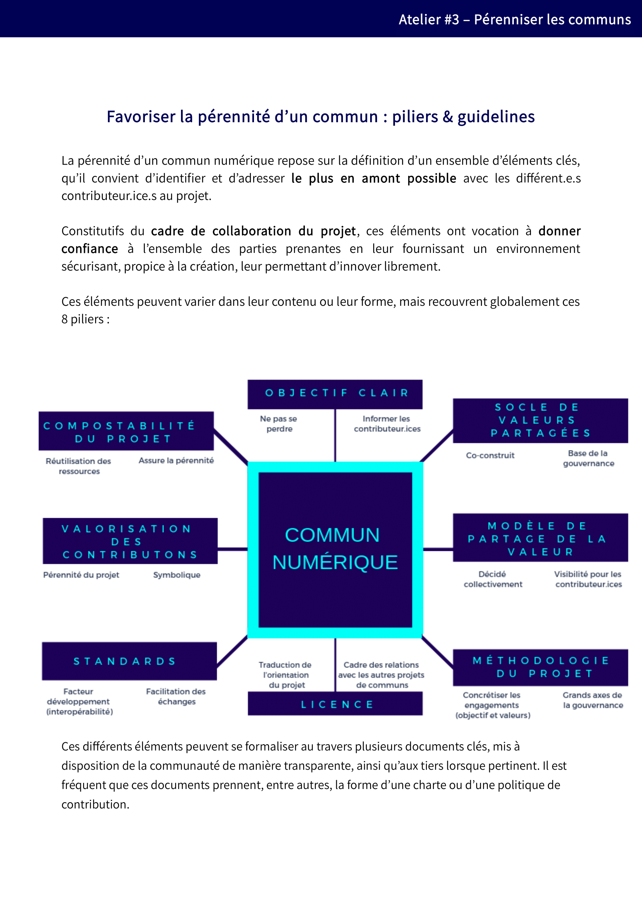
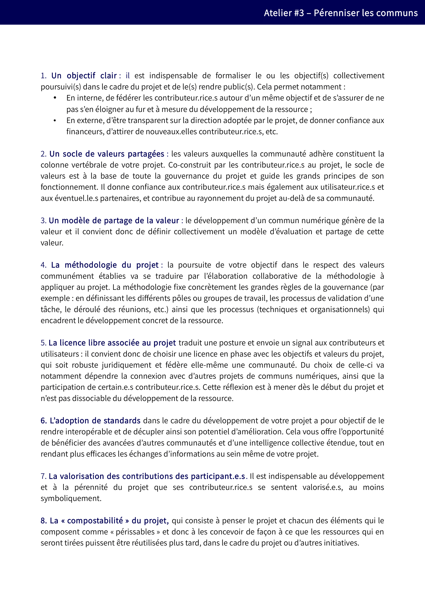

# 4. Maintenir / Pérenniser 

Le commun tire sa force de la pérennité du modèle sur lequel il repose. Ainsi, aussi longtemps qu’il est utile à ses utilisateurs, il doit pouvoir continuer à évoluer et s’adapter à leurs attentes. 

Ce statut n’est néanmoins pas automatique, et nécessite notamment la formalisation d’un certain nombre de règles et la mise en place d’une gouvernance partagée. Il convient aussi d’anticiper les divers risques afin d’assurer un modèle pérenne techniquement, juridiquement et économiquement.

## 4.1. Faut-il formaliser des règles pour pérenniser le commun numérique ?

En bref, En bref, OUI. La mise en place de ce cadre est essentielle afin d’assurer la confiance entre les contributeurs et ainsi pérenniser le développement du projet. En effet, tout risque d’«appropriation» (d’ «enclosure») non souhaitée sera très mal vécu par les membres de la communauté et doit être exclu. A cette fin, il est essentielle de mettre en place une gouvernance démocratique du commun, laissant la possibilité à chaque contributeur de s'exprimer, ainsi que d'être force de proposition.

Ce cadre regroupe l’ensemble des documents et pratiques structurantes à mettre en place afin de régir la collaboration des contributeurs au commun et prend différentes formes (des statuts, une charte de valeurs, la licence attachée à la ressource, etc.). 

Chaque cadre de collaboration est unique, il s’adapte aux enjeux et problématiques propres au projet et à la communauté auxquels il se rapporte : relations entre contributeurs, valeurs partagées, relations avec l’extérieur, méthodes de travail, etc. L’harmonisation croissante des différents points ainsi abordés favorise la mutualisation entre les projets et rassure les contributeurs qui retrouvent ainsi des repères partagés entre les différents projets de communs. 

**Ressources**

Ces piliers & lignes directrices pour favoriser la pérennité d’un commun constituent des exemples d'éléments-clés ayant vocation à donner confiance  l’ensemble des parties prenantes en leur fournissant un environnement sécurisant et propice à la création. Vous pourrez en trouver une version éditable sur notre framagit; ainsi qu'une [Méthodologie pour définir le cadre de collaboration d’un projet](https://framagit.org/inno3/tutoriel-communs-numeriques/blob/master/ressources/M%C3%A9thodologie%20SpeedBoat%20-%20Cadre%20de%20collaboration.pdf) permettant la conduite d’un exercice collectif dit «du speedboat», qui a pour objectif de lister les leviers, freins et obstacles rencontrés par le projet ou qui peuvent se présenter à lui. Cet exercice permet également d’identifier les éléments structurants les plus adaptés pour tirer profit des leviers et anticiper les freins et obstacles potentiels.

## 4.2. Quelle gouvernance prévoir pour encadrer les relations entre les acteurs ?

Les relations des contributeurs à un projet de commun numérique sont nombreuses et diverses, allant de la simple coordination de contributions à des prises de décisions sur l’avenir de la ressource. 

À cette fin, il est important de mettre en place une gouvernance pour structurer ces relations et, ainsi, de donner une légitimité interne aux décisions prises par la communauté. Les effets se feront sentir en termes de confiance accrue dans le projet en interne et en externe. 

À ce titre, le choix ou non d’une structure juridique, partiellement ou totalement dédiée, pour formaliser cette gouvernance peut en conditionner ou implémenter certains aspects. Si la nécessité de disposer d’une personnalité juridique perdure afin d’agir en justice, de bénéficier de certaines aides ou de contractualiser, des outils numériques étendent aujourd’hui le champ des actions susceptibles d’être réalisées en dehors d’un tel cadre (telle que la plateforme [OpenCollective](https://opencollective.com). La nécessité de créer une structure juridique, voire la solution intermédiaire d’être hébergé au sein d’une structure existante, est généralement recommandée lorsqu’un intérêt collectif fort réunit les différents acteurs ou qu’il existe un risque à maintenir la responsabilité des actions sur les seuls membres.

Les modèles associatifs ou coopératifs (SCOP ou SCIC) sont particulièrement souples et adaptés pour soutenir le développement d’un commun, néanmoins d’autres formes (GIE, SAS, GIP, etc.) peuvent parfaitement aboutir à des résultats similaires dès lors que leur objet est tourné vers la réalisation de cet objectif.

Par ailleurs, si la mise en place d’une gouvernance est essentielle, il n’existe pas de gouvernance idéale – sinon celle qui répond au mieux aux enjeux et problématiques spécifiques au projet auquel elle s’applique. La majorité des gouvernances de projets de communs numériques partagent certains éléments tels que la volonté d’être lisibles et compréhensibles par toutes les parties prenantes au projet, des mécanismes assurant la transparence des décisions prises, et des dispositifs permettant l’ouverture de la gouvernance aux contributeurs, voire aux partenaires externes au projet. 

**Ressources**

Sur notre framagit, vous pourrez retrouver :

* [Des exemples de structurations juridiques constituées autour de communs numériques](https://framagit.org/inno3/tutoriel-communs-numeriques/blob/master/ressources/Exemples_StructuresJuridiques_Communs.pdf) : tableau synthétique basé sur les projets détaillés en atelier permettant de présenter les différentes structurations juridiques formalisées.
* [Des exemples de gouvernance](https://framagit.org/inno3/tutoriel-communs-numeriques/blob/master/ressources/ExemplesChartes-CadresCollaboration.pdf) : exemples des chartes rédigées par d’autres projets, notamment Federation et La Fabrique des mobilités.

## 4.3. À quels enjeux juridiques la communauté doit-elle répondre ?

Le droit se manifestant à chaque collaboration, tout projet de commun numérique devra s’organiser pour appréhender et utiliser les instruments juridiques lui permettant de renforcer le développement du projet, favoriser la confiance vis-à-vis des acteurs extérieurs du projet et accélérer l’innovation portée par le projet.

Les enjeux juridiques peuvent ainsi être multiples :

*    **Concernant le développement de la ressource** : la licence du projet (cf. [4.4. Pourquoi choisir une licence libre pour diffuser le commun numérique ?](https://vbachelet.frama.io/tutoriel-communs-numeriques/02-Tutoriel/#44-pourquoi-choisir-une-licence-libre-pour-diffuser-le-commun-numerique)), les contrats avec les contributeurs, la marque, voire les brevets relatifs au projet et tous les autres aspects juridiques spécifiques à une réglementation (notamment les règles en matière d’export, de santé, de chiffrement, etc.). Des référentiels existent ; 
*    **Concernant l’organisation des relations avec des tiers** : les prestations, les conventions de partenariats, les suivis de subventions ou des dons, les adhésions croisées ou encore les actions en justice.
* Ces enjeux juridiques sont importants à traiter, au risque sinon d’en faire peser la charge sur quelques contributeurs personnellement. Relativement communs aux projets de communs numériques, ils sont parfois mutualisés au sein de «fondations parapluies». 

**Ressources**

   * [Veni, Vidi, Libri : le projet de l’association Veni Vedi Libri](vvlibri.org/fr) répondra aux principales questions rencontrées par des communs numériques.

## 4.4. Pourquoi choisir une licence libre pour diffuser le commun numérique ? 

Juridiquement, les licences libres sont des contrats par lesquels les titulaires de droits de propriété intellectuelle concèdent gratuitement et de manière non exclusive l’ensemble de leurs droits d’exploitation, pour le monde entier et toute la durée de leurs droits. En pratique, ces contrats organisent un partage des droits qui permet à toute personne d’exploiter la ressource dans la même mesure que l’auteur original.

L’utilisation de ce type de licence est un prérequis en matière de communs numériques. En effet, c'est le mécanisme propre aux licences libres qui assure qu’un contributeur ne pourra pas plus tard empêcher la réutilisation de sa contribution : les conditions étant clairement définies en amont et les droits automatiquement cédés, tout autre contributeur pourra s’appuyer sur ces ressources afin de les utiliser, modifier, adapter et/ou redistribuer. À noter que ces autorisations ne couvrent que l’usage de la propriété intellectuelle, ainsi tout usage qui porterait préjudice à un auteur ou contributeur serait – ce n’est qu’un exemple – condamnable sur le fondement de la responsabilité classique.

Les licences libres ont enfin l’avantage particulièrement fort d’être standardisées à l’échelle internationale : ainsi la contribution réalisée au sein d’un commun numérique pourra facilement être réutilisée au sein d’un autre, ce qui démultiplie encore le potentiel de mutualisation et de partage.

**Ressources**

*    [Mooc Comprendre l'Open Source](https://framatube.org/video-channels/e4985792-98ca-49be-a1aa-bceecd1c8051/videos)
*    [Veni, Vidi, Libri : le projet de l’association Veni Vedi Libri](vvlibri.org/fr) répondra aux principales questions rencontrées par des communs numériques.
*    [La « politique » Framabook et les licences libres (par C. Masutti et B. Jean)](https://framablog.org/2013/10/16/framabook-et-licences-libres/) : document détaillant l’articulation du régime des licences, en matière de gestion de la propriété intellectuelle, et des différents usages susceptibles d’être sanctionnés sur la base d’un autre fondement.

## 4.5. Faut-il associer un modèle économique au commun numérique ?
 
Contrairement à un projet d’entreprise, la conception d’un commun numérique n’a pas pour objectif de créer une économie de rente. Néanmoins, une autonomie financière peut être recherchée afin d’assurer les conditions de la pérennité du projet. Complémentaire ou alternatif au financement traditionnellement basé sur la contribution bénévole et le don, ce modèle présente certains avantages et notamment celui de s’appuyer sur la force de l’économie, et plus précisément sur l’intérêt économique que les membres du commun ont à maintenir ce commun.

Un tel objectif doit néanmoins concilier les conditions nécessaires à l’autofinancement du commun sans pour autant l’isoler des préoccupations des membres de la communauté, c’est à dire de l’intérêt collectif auquel il doit continuer à répondre. Sous cette condition, il est tout à fait possible d’envisager *la construction d’un commun numérique autour d’un modèle économique tourné vers le développement de la ressource.*

Ce modèle économique peut se traduire de plusieurs manières :

   * **Activité économique externe** : par la mise en place d’un environnement favorable aux acteurs économiques. Ce modèle de financement est aujourd’hui le plus répandu : il s’agit de mettre en place un modèle économique périphérique au commun numérique en tant que tel (par exemple par de la vente de services ou de produits – logiciels ou matériels – basés sur le commun). Ainsi, le commun numérique pourra bénéficier de contributions diverses de la part de ces acteurs économiques directement intéressés par le développement et la pérennisation du commun dont dépend leur activité. 
   * **Activité économique interne** : en organisant certaines activités du commun de sorte à autofinancer certains frais inhérents au développement ou à la pérennisation du commun. Il s’agit ainsi généralement de proposer des prestations complémentaires (services «premium», conférences, etc.). Un tel modèle bénéficie de la place centrale qu’occupe le commun, mais fait courir le risque soit de détourner le commun de son objet (ce qui était un moyen devient une fin), soit de concurrencer certains membres de la communauté (ou, pire, d’en favoriser certains au détriment d’autres). 
   * **Activité économique mixte** : en articulant les deux modèles précédents. Il est ainsi possible de prévoir des mécanismes par lesquels les contributeurs sont incités à contribuer au commun numérique en raison de leur propre modèle économique tout en prévoyant que l’organisation qui gère le commun se voie conférer un monopole sur l’exercice de certains services nécessaires pour pérenniser le commun (par exemple une vente de certification, la délivrance de label ou d’autorisation au travers d’un usage de la marque, etc.).
Là encore, les modèles sont divers et variés et beaucoup restent à construire.
