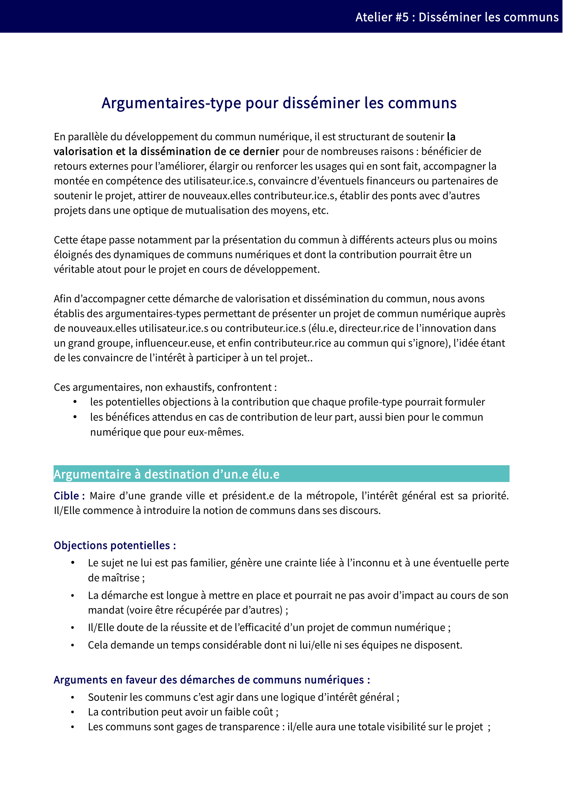

# 6. Disséminer 

## 6.1. Pourquoi disséminer un commun numérique au-delà de sa communauté initiale ?

La pérennité du commun repose notamment sur la communauté qui le compose. Dans le domaine numérique, un tel objectif passe en premier lieu par l’augmentation du nombre d’utilisateurs. En effet, la démultiplication des utilisateurs ne réduit par la valeur ni même l’usage du commun numérique (cf. [1.1.1 Comment se caractérise un commun numérique ?](https://vbachelet.frama.io/tutoriel-communs-numeriques/02-Tutoriel/#11-quand-parle-t-on-de-communs-numeriques)) mais favorise au contraire l’accroissement du nombre de contributeurs finaux.

La dissémination doit aussi viser, au-delà du nombre, à enrichir la communauté des utilisateurs de personnes aux profils différents. Cette diversité permet d’éviter l’entre-soi, de renforcer le caractère générique du commun numérique et, ce faisant, d’ouvrir les champs d’application potentiels.

## 6.2. Comment organiser la démarche de dissémination d’un commun numérique ?

Afin de toucher le plus large public possible, la dissémination reposera notamment sur une communication adaptée à différents profils. Elle devra être à la fois passive (rendre accessible l’information à ceux qui la recherchent) et active (toucher de nouvelles personnes par des démarches spécifiques).

Selon les cibles, une telle communication devra mettre en avant la finalité du projet (par exemple «encyclopédie botanique collaborative» pour Tela Botanica ou «base de données géographiques communautaire» pour Open Street Map), ou encore son caractère de commun et/ou Open Data et/ou Logiciel Libre. La communication est d’autant plus complexe que la culture du commun n’est pas encore complètement démocratisée.

Dans une approche collaborative, il peut être intéressant de prévoir des ressources prêtes à l’emploi et accessibles à tous au niveau du projet afin que tous les contributeurs puissent participer à cette dissémination du projet sans dénaturer l’image du projet. Dans le même esprit, l’aspect ouvert du commun amène à diffuser ces mêmes supports au-delà de la communauté afin que quiconque souhaite s’informer ou communiquer sur le projet dispose des éléments appropriés pour le faire. 

**Ressources**

Vous pourrez retrouver cet argumentaire ainsi que d'autres à destination de publics différents sur notre framagit : [Liste d’argumentaires](https://framagit.org/inno3/tutoriel-communs-numeriques/blob/master/referentiels/5_Argumentaires_DisseminationCommuns.pdf). Chaque argumentaire constitue un référentiel coconstruit listant les besoins un certain nombre d’arguments susceptibles d’être mis en avant afin de communiquer sur le caractère particulier du commun et les avantages associés.
